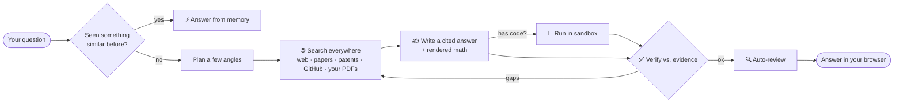

<div align="center">

# 🔎 Research Assistant

### Ask anything technical. It searches everywhere, reads the evidence, runs the code, and answers — cited and verified.

<br/>


<br/>

[**🚀 Quick start**](#-quick-start-2-minutes) • [**✨ Features**](#-what-you-get) • [**🔑 Models**](#-pick-a-model) • [**👤 Accounts**](#-accounts--sign-in) • [**🧠 How it works**](#-how-it-works) • [**⚙️ Config**](#%EF%B8%8F-configuration)

</div>

---

## 🎬 Try it in 30 seconds

> Type one of these and watch it plan → search → verify → answer, live:
>
> | Ask this | What you'll see |
> |---|---|
> | *"Compare MVDR beamforming with modern neural beamformers."* | A cited, structured explanation with rendered math |
> | *"Read this arXiv paper and explain the algorithm."* | A grounded walkthrough from the source |
> | *"Implement and benchmark quicksort vs mergesort on 100k ints."* | Code **written and run in a sandbox**, then verified |
> | *"What changed in MVDR recently?"* | Fresh results — it prefers the latest sources |

---

## ✨ What you get

<table>
<tr>
<td width="50%" valign="top">

**🌐 Searches everywhere**
The web, arXiv, Semantic Scholar, Wikipedia, patents, GitHub — and your own uploaded PDFs — on every question.

**✅ Grounded & cited**
Answers come only from retrieved evidence. Nothing invented. It says so plainly when sources conflict or fall short.

**🔁 Verifies itself**
A draft → verify → search‑again → refine loop, plus an automatic peer‑review pass before you ever see the answer.

</td>
<td width="50%" valign="top">

**🤖 Runs code**
Coding tasks are written, executed in a locked‑down Docker sandbox, and refined until they actually work.

**🧠 Remembers**
Ask the same or a similar question again and it answers **instantly from memory** — no new search, no spend.

**💎 Premium UI**
A polished sign‑in, a clean dark/light app, a live "thinking" panel, rendered LaTeX, IDE‑style code blocks, and an **Ask‑again** (regenerate) button on every question.

</td>
</tr>
</table>

---

## 🚀 Quick start (2 minutes)

```bash
python -m venv .venv
# Windows:        .\.venv\Scripts\Activate.ps1
# macOS / Linux:  source .venv/bin/activate

pip install -r requirements.txt
copy .env.example .env        # macOS/Linux: cp .env.example .env
python run.py
```

Open **http://localhost:8600**, create an account, and ask away. Web search works out of the box with **no API key** — you just need a chat model (below).

---

## 🔑 Pick a model

The chat client is **OpenAI‑compatible**, so any provider works by name — the in‑app dropdown ships with two:

| Model | Cost | Get a key |
|---|---|---|
| 🔵 **Gemini 2.5 Flash** *(default)* | **Free** | [aistudio.google.com/apikey](https://aistudio.google.com/apikey) → paste into `GEMINI_API_KEY` |
| 🟢 **GPT‑5.5** | Paid | Your OpenAI key → paste into `OPENAI_CLOUD_KEY` |

> Switch live from the **model dropdown** in the bottom‑left. The endpoint + key route automatically by model name — no `.env` edits needed once the keys are set.

<details>
<summary><b>➕ Want more providers (Groq, DeepSeek, local Ollama)?</b></summary>

The router resolves any OpenAI‑compatible model by name — just point `OPENAI_BASE_URL` / `OPENAI_MODEL` at it, or extend `CLOUD_MODELS` in `webapp/settings.py`. Examples:

```env
# Local Ollama (free, offline):  ollama pull qwen3:8b
OPENAI_API_KEY=ollama
OPENAI_BASE_URL=http://localhost:11434/v1
OPENAI_MODEL=qwen3:8b

# Groq (free, fast):
OPENAI_BASE_URL=https://api.groq.com/openai/v1
OPENAI_MODEL=llama-3.3-70b-versatile
```

</details>

---

## 👤 Accounts & sign‑in

Auth is on by default (`ENABLE_AUTH=true`) — a polished split‑screen sign‑in with:

- **Sign up / sign in** with a username (or email) + password
- **Forgot password** → a secure, single‑use, 30‑minute reset link (emailed via SMTP, or shown on‑page for a local single‑user setup)
- Each account's conversations stay **private**

<details>
<summary><b>🔐 First account & admin CLI</b></summary>

Self‑service sign‑up is enabled (`ENABLE_SIGNUP=true`) — just click **Create an account**. Or manage users from the CLI:

```bash
python -m backend.auth.users add  <user_id>     # create (prompts for password)
python -m backend.auth.users list
python -m backend.auth.users passwd <user_id>   # reset a password
```
Set a stable `AUTH_SECRET_KEY` in `.env` for sessions that survive restarts.

</details>

---

## 🧠 How it works



**Search broadly → keep the best evidence → answer only from it → check it → remember it.**

---

## 📚 Use your own PDFs (optional)

Turn on local search to fold your papers into every answer:

```env
ENABLE_LOCAL_RAG=true
ORACLE_DSN=localhost:1521/FREEPDB1     # Oracle 23ai (e.g. in Docker)
GEMINI_API_KEY=<key>                   # free embeddings
```

Click **＋ Add papers** in the sidebar — your PDFs are parsed, chunked, embedded, and searched **together with the web**. Without it, the app runs web‑only (no database needed).

---

## 🤖 Autonomous agents (CLI too)

```bash
# Code agent — think → write → run in Docker → review → refine
python -m backend.agent "Find the fastest correct primality test up to 10^7 and benchmark it"

# Deep‑research agent — a full cited report (optionally via LangGraph: RESEARCH_ENGINE=langgraph)
python -m backend.agent.research_agent "How do modern neural beamformers compare to MVDR?"
```

Generated code runs **only** in a network‑less, resource‑capped, auto‑removed container — never on your machine.

---

## ⚙️ Configuration

The real `.env` is gitignored; the full commented template is **[.env.example](.env.example)**. The knobs you'll actually touch:

| Variable | What it does |
|---|---|
| `GEMINI_API_KEY` / `OPENAI_CLOUD_KEY` | Keys for the Gemini / GPT‑5.5 options |
| `ENABLE_WEB_SEARCH` | Search the public web / papers / patents / GitHub (on) |
| `ENABLE_LOCAL_RAG` | Also search your uploaded PDFs (needs Oracle) |
| `ENABLE_ANSWER_CACHE` | Reuse saved answers for repeat/similar questions |
| `AGENTIC_MAX_VERIFY_ROUNDS` · `AUTO_REVIEW` | How hard it verifies & reviews (accuracy vs. speed) |
| `ENABLE_AUTH` · `ENABLE_SIGNUP` | Login + self‑service sign‑up |

<details>
<summary><b>🔗 Share it beyond your machine</b></summary>

```bash
python run.py --share   # public https://…trycloudflare.com link
python run.py --lan     # reachable on your Wi-Fi
```
Keep `ENABLE_AUTH=true` so visitors must sign in. ⚠️ This build has **no SSRF guard** on external fetches (removed by request) — don't expose it on an untrusted network without re‑adding IP checks in `backend/external_search/base.py`.

</details>

---

## 🧪 Develop

```bash
.\.venv\Scripts\python.exe -m pytest            # 145 tests, all offline/mocked
.\.venv\Scripts\pyflakes backend webapp tests   # lint
python pipeline.py --status                      # inspect the local PDF index
```

```
backend/   retrieval · external search · LLM provider · agents · memory · auth · embeddings
webapp/    FastAPI server + chat orchestration + static UI (no build step)
docs/      deeper architecture notes
run.py     launch the app  (--share / --lan)
```

---

<div align="center">
<sub>Python · FastAPI · vanilla HTML/CSS/JS · KaTeX · Docker — no frontend build step.</sub>
</div>
