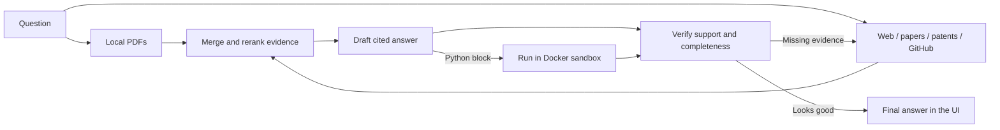
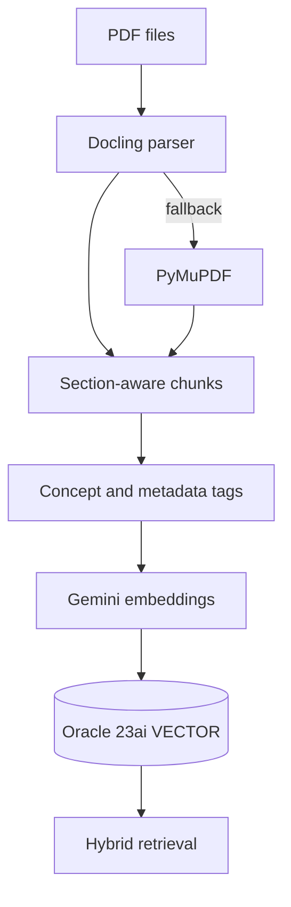
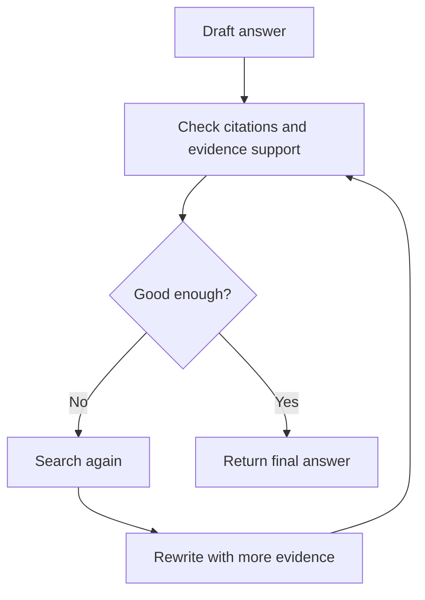

<div align="center">

# Research Assistant

**A source-grounded research workspace for papers, web sources, patents, GitHub repos, and runnable code.**

Ask a technical question. The app searches the right sources, reads the evidence,
checks the answer, and streams back a cited response you can inspect.


[Quick start](#quick-start) |
[How it works](#how-it-works) |
[Configuration](#configuration) |
[Project layout](#project-layout) |
[Docs](#docs)

</div>

---

## What This Is

Research Assistant is a local web app for technical research. It is built for
questions like:

- "Compare MVDR beamforming with modern neural beamformers."
- "Read this paper and explain the algorithm."
- "Find recent GitHub implementations and write a clean Python version."
- "Search papers, patents, and repos before answering."
- "Generate a small simulation and verify that it runs."

The important bit: answers are grounded in evidence. Sources are shown in the UI,
and non-trivial claims are cited with numbered references.

---

## At A Glance

| Area | What the app does |
|------|-------------------|
| Web UI | Streaming chat, source drawer, model picker, dark mode, conversation history |
| External research | Searches web pages, arXiv, Semantic Scholar, Wikipedia, patents, GitHub, and online PDFs |
| Local papers | Upload PDFs, parse them, embed chunks, and search them with Oracle vector search |
| Answering | Builds cited evidence, drafts an answer, verifies it, and searches again when needed |
| Code tasks | Can write Python and run it in a locked-down Docker sandbox |
| Safety | SSRF guard, request limits, secret-safe `.env`, Docker isolation for generated code |

---

## How It Works



The pipeline is intentionally boring in the best way:

1. Search broadly.
2. Keep the best evidence.
3. Ask the model to answer only from that evidence.
4. Verify the answer.
5. Search again if the answer is weak.
6. Show the final answer with citations.

---

## Quick Start

```powershell
python -m venv .venv
.\.venv\Scripts\Activate.ps1
pip install -r requirements.txt
copy .env.example .env
python run.py
```

Open:

```text
http://localhost:8600
```

The app binds to `127.0.0.1` by default, so it is local to your machine.

<details>
<summary><strong>macOS / Linux shell version</strong></summary>

```bash
python -m venv .venv
source .venv/bin/activate
pip install -r requirements.txt
cp .env.example .env
python run.py
```

</details>

---

## Choose A Setup

### Option 1: Web-only mode

Use this when you want the fastest setup with no Oracle database and no uploaded
papers.

```env
ENABLE_LOCAL_RAG=false
ENABLE_WEB_SEARCH=true

OPENAI_API_KEY=<key>
OPENAI_MODEL=gpt-4o
```

Free external sources still work out of the box:

- DuckDuckGo
- arXiv
- Semantic Scholar
- Wikipedia
- GitHub repo search

Optional paid search keys such as Tavily, Brave, or SerpAPI can improve web
search quality.

### Option 2: Add your own PDFs

Use this when you want your uploaded papers searched together with public sources.

```env
ENABLE_LOCAL_RAG=true
ORACLE_DSN=localhost:1521/FREEPDB1
GEMINI_API_KEY=<key>
```

Then upload PDFs from the app. The pipeline parses, chunks, embeds, and stores
them for retrieval.

### Option 3: OpenRouter or another OpenAI-compatible provider

The chat client is OpenAI-compatible. You can point it at an OpenAI-compatible
proxy such as OpenRouter:

```env
OPENAI_API_KEY=<key>
OPENAI_BASE_URL=https://openrouter.ai/api/v1
OPENAI_MODEL=deepseek/deepseek-chat
```

Keep real keys only in `.env`. Never commit `.env`.

---

## What You Can Search

| Source | Default support | Notes |
|--------|-----------------|-------|
| Uploaded PDFs | Optional | Requires local Oracle RAG setup |
| Web pages | Yes | DuckDuckGo by default; Tavily/Brave/SerpAPI optional |
| Research papers | Yes | arXiv and Semantic Scholar |
| Wikipedia | Yes | Useful for background and definitions |
| Patents | Yes | Routed through web search with patent focus |
| GitHub repos | Yes | Token optional for higher limits |
| GitHub code search | Optional | Requires `GITHUB_TOKEN` |
| Online PDFs | Yes | Size and page capped |

---

## Local PDF Pipeline



The local pipeline combines:

- Docling for layout-aware parsing.
- PyMuPDF as a fallback.
- Optional OCR for scanned PDFs.
- Gemini embeddings for vectors.
- Oracle 23ai native vector search.
- Optional turbovec compressed vector cache for faster local dense search.
- BM25 keyword search.
- RRF fusion, cross-encoder reranking, and MMR diversification.

---

## Answer Verification

The web chat can run a bounded verification loop:



If the answer contains Python, the app can run the best code block in the same
networkless Docker sandbox used by the CLI agent. The run result is included in
verification so broken code is easier to catch.

---

## Agent Mode

For coding or algorithm tasks, the assistant can move beyond plain Q&A:

```text
think -> write code -> run in Docker -> review output -> refine
```

CLI examples:

```bash
python -m backend.agent "Find the fastest correct primality test up to 10^7 and benchmark it"
python -m backend.agent --no-search --iters 6 "Compare quicksort and mergesort on 100k integers"
python -m backend.agent --brief docs/PROJECT_BRIEF.example.md
```

Docker is required for code execution. Generated code is not run directly on the
host machine.

---

## Configuration

The real `.env` file is private and ignored by Git. The public template is
[.env.example](.env.example).

Common settings:

| Variable | Meaning |
|----------|---------|
| `OPENAI_API_KEY` | Chat model key |
| `OPENAI_MODEL` | Chat model name or OpenAI-compatible model slug |
| `OPENAI_BASE_URL` | Optional OpenAI-compatible endpoint |
| `GEMINI_API_KEY` | Gemini embeddings key |
| `ENABLE_WEB_SEARCH` | Enable public source search |
| `ENABLE_LOCAL_RAG` | Enable local Oracle/PDF retrieval |
| `VECTOR_BACKEND` | `oracle` or optional `turbovec` dense retrieval |
| `TURBOVEC_ENABLED` | Enable optional compressed local vector cache |
| `ENABLE_GRAPH_RAG` | Enable optional Memgraph expansion |
| `ENABLE_AUTH` | Require login |
| `EXTERNAL_ALLOW_UNSAFE_URLS` | Disable SSRF guard; keep `false` for shared deployments |
| `ENABLE_AGENTIC_ANSWER_LOOP` | Enable draft -> verify -> refine loop |

<details>
<summary><strong>Example minimal .env</strong></summary>

```env
DEBUG_MODE=false

OPENAI_API_KEY=<key>
OPENAI_MODEL=gpt-4o

ENABLE_WEB_SEARCH=true
ENABLE_LOCAL_RAG=false

GEMINI_API_KEY=<key>
EMBEDDING_PROVIDER=google
EMBEDDING_MODEL=gemini-embedding-2

ENABLE_AUTH=false
EXTERNAL_ALLOW_UNSAFE_URLS=false
```

</details>

---

## Optional GraphRAG

GraphRAG adds relationship-aware expansion over your indexed PDFs. It can help
with comparison questions and multi-hop questions.

```bash
docker run -p 7687:7687 -p 7444:7444 --name memgraph memgraph/memgraph-mage
```

```env
ENABLE_LOCAL_RAG=true
ENABLE_GRAPH_RAG=true
MEMGRAPH_URI=bolt://localhost:7687
```

Build the graph:

```bash
python -m backend.graph_rag.build_graph
```

Oracle remains the source of truth for full text and citations. Memgraph only
adds relationship expansion.

---

## Optional Turbovec

turbovec is an optional compressed vector-search cache for local PDFs. Oracle
still stores papers, chunks, metadata, and citations; turbovec only speeds up
the dense-vector candidate search.

```env
ENABLE_LOCAL_RAG=true
VECTOR_BACKEND=turbovec
TURBOVEC_ENABLED=true
TURBOVEC_BIT_WIDTH=4
TURBOVEC_OVERFETCH=3
```

Build or inspect the cache:

```bash
python -m backend.retrieval.turbovec_index build
python -m backend.retrieval.turbovec_index status
```

If the cache is missing or stale, the app can rebuild it automatically. If
turbovec is unavailable, retrieval falls back to Oracle unless
`TURBOVEC_STRICT=true`.

---

## Team Login

Enable auth:

```env
ENABLE_AUTH=true
AUTH_SECRET_KEY=generate_a_long_random_value
```

Create users:

```bash
python -m backend.auth.users add alice
python -m backend.auth.users list
python -m backend.auth.users passwd alice
python -m backend.auth.users delete alice
```

When auth is enabled, each user gets private conversations.

---

## Safety Notes

- `.env` contains secrets and must not be committed.
- Keep `EXTERNAL_ALLOW_UNSAFE_URLS=false` before sharing the app.
- Generated Python runs inside Docker, not on the host.
- External fetches are size-capped and timeout-limited.
- API keys stay server-side.

---

## Tech Stack

| Layer | Technology |
|-------|------------|
| Backend | Python 3.11, FastAPI, Uvicorn |
| Frontend | HTML, CSS, vanilla JavaScript |
| Streaming | Server-Sent Events |
| Local vector DB | Oracle Database Free 23ai |
| Optional vector accelerator | turbovec |
| Local graph | Memgraph, optional |
| Embeddings | Gemini `gemini-embedding-2` or local sentence-transformers |
| Reranking | BAAI `bge-reranker-v2-m3` |
| PDF parsing | Docling, PyMuPDF, optional OCR |
| Chat model | OpenAI client, with optional OpenAI-compatible base URL |
| External search | DuckDuckGo, Tavily, Brave, SerpAPI, arXiv, Semantic Scholar, Wikipedia, GitHub |
| Code sandbox | Docker |
| Tests | pytest |

---

## Project Layout

```text
Audio-research-assistant/
|-- run.py                  # local web launcher
|-- pipeline.py             # local PDF index builder
|-- backend/
|   |-- agent/              # code agent, sandbox runner, hooks, memory
|   |-- answering/          # answer loop, verifier, reviewer
|   |-- external_search/    # web, papers, patents, GitHub, online PDFs
|   |-- graph_rag/          # optional Memgraph GraphRAG
|   |-- ingestion/          # PDF parsing, chunking, embedding
|   |-- llm/                # streaming chat provider
|   |-- retrieval/          # hybrid retrieval and fusion
|   |-- memory/             # conversation memory and backup
|-- webapp/                 # FastAPI app and static UI
|-- scripts/                # admin/operator helpers
|-- tests/                  # pytest suite
|-- docs/                   # architecture and project notes
|-- data/                   # local runtime data, caches, papers, logs
```

More naming guidance lives in [docs/PROJECT_STRUCTURE.md](docs/PROJECT_STRUCTURE.md).

---

## Development

```bash
python -m pytest -q
pyflakes backend webapp
```

Useful commands:

```bash
python pipeline.py --status
python pipeline.py --incremental
python -m backend.database.db_status
python -m backend.evaluation.evaluate_retrieval
python -m backend.evaluation.evaluate_llm
```

---

## Docs

| Document | What it is for |
|----------|----------------|
| [docs/PIPELINE.md](docs/PIPELINE.md) | End-to-end architecture walkthrough |
| [docs/TECH_STACK.md](docs/TECH_STACK.md) | Tool and technology reference |
| [docs/TECHNOLOGY_AND_IMPROVEMENTS.md](docs/TECHNOLOGY_AND_IMPROVEMENTS.md) | Design choices and improvements |
| [docs/PROJECT_STRUCTURE.md](docs/PROJECT_STRUCTURE.md) | Folder and naming rules |
| [docs/TURBOVEC_ACCELERATOR.md](docs/TURBOVEC_ACCELERATOR.md) | Optional compressed vector-search cache |
| [docs/CLAUDE_INTERACTIVE_PDF_BRIEF.md](docs/CLAUDE_INTERACTIVE_PDF_BRIEF.md) | Prompt brief for generating an interactive PDF |

---

## License And Credits

This repo includes project-specific Claude Code guidance and selected ECC-derived
workflow material. Imported ECC material is MIT licensed; see `.claude/ECC_LICENSE`.

The code agent design credits ideas from `auto-deep-researcher-24x7`
(Apache-2.0), implemented here as original project code.

---

<div align="center">

Built for research answers that can be checked, traced, and improved.

</div>
