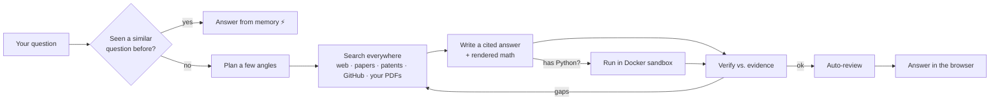

<div align="center">

# 🔎 Research Assistant

**Ask anything technical — it searches everywhere, reads the evidence, runs the code, and gives you a clean, verified answer.**


[🚀 Quick start](#-quick-start-2-minutes) ·
[✨ What it does](#-what-it-does) ·
[🧩 Pick a model](#-pick-a-model-free-options-too) ·
[🧠 How it works](#-how-it-works) ·
[⚙️ Configuration](#%EF%B8%8F-configuration)

</div>

---

## ✨ What it does

Type a question. Behind the scenes it:

1. **Plans** a few angles on your question.
2. **Searches everywhere** — the web, arXiv, Semantic Scholar, Wikipedia, patents, GitHub, **and your own PDFs**.
3. **Writes** a clear, well‑structured answer — with **rendered math** ($\LaTeX$) and IDE‑style code blocks.
4. **Checks itself** — verifies the answer against the evidence and **auto‑reviews** it for quality (no button to click).
5. **Remembers** it — ask the same or a *similar* question again and it answers **instantly from memory**, spending nothing.

For coding questions it can **write Python and run it** in a locked‑down Docker sandbox, refining until it works.

> 💡 **Try asking:**
> - *"Compare MVDR beamforming with modern neural beamformers."*
> - *"Read this paper and explain the algorithm."*
> - *"Find recent GitHub implementations and write a clean Python version."*
> - *"Implement and benchmark quicksort vs mergesort on 100k integers."*

---

## 🚀 Quick start (2 minutes)

```bash
python -m venv .venv
# Windows:        .\.venv\Scripts\Activate.ps1
# macOS / Linux:  source .venv/bin/activate
pip install -r requirements.txt
copy .env.example .env        # macOS/Linux: cp .env.example .env
python run.py
```

Then open **http://localhost:8600** and ask away. It runs on `127.0.0.1` (this machine only).

You only need **one** thing in `.env`: a chat model (see below). Web search works out of the box with **no API key**.

---

## 🧩 Pick a model (free options too)

The chat client is OpenAI‑compatible, so it works with several providers — just set three lines in `.env`. **No code changes needed.**

| Option | Cost | `.env` |
|--------|------|--------|
| 🖥️ **Local Ollama** (offline) | **Free** | `OPENAI_API_KEY=ollama`<br>`OPENAI_BASE_URL=http://localhost:11434/v1`<br>`OPENAI_MODEL=qwen3:8b` |
| 🟣 **OpenRouter** (DeepSeek, Claude, 300+) | cheap | `OPENAI_API_KEY=sk-or-v1-…`<br>`OPENAI_BASE_URL=https://openrouter.ai/api/v1`<br>`OPENAI_MODEL=deepseek/deepseek-chat` |
| 🟢 **OpenAI** | paid | `OPENAI_API_KEY=sk-…`<br>`OPENAI_MODEL=gpt-4o` |
| 🔵 **Google Gemini** (free tier) | **Free** | `OPENAI_API_KEY=<gemini key>`<br>`OPENAI_BASE_URL=https://generativelanguage.googleapis.com/v1beta/openai/`<br>`OPENAI_MODEL=gemini-2.5-flash` |

<details>
<summary><b>🛠️ Run fully local + free with Ollama</b></summary>

```bash
ollama pull qwen3:8b            # chat / research model
ollama pull qwen2.5-coder:7b   # (optional) model for coding tasks
```
Then in `.env`:
```env
OPENAI_API_KEY=ollama
OPENAI_BASE_URL=http://localhost:11434/v1
OPENAI_MODEL=qwen3:8b
AGENT_MODEL=qwen2.5-coder:7b   # the code agent uses the coder model
```
> Local models are private and free, but slower. If answers feel sluggish, lower
> `DEEP_SEARCH_SUBQUERIES=1` and `AGENTIC_MAX_VERIFY_ROUNDS=1` in `.env`.

</details>

You can also switch models live from the **Model** dropdown in the top bar.

---

## 🧠 How it works



The idea is simple: **search broadly → keep the best evidence → answer only from it → check the answer → remember it.**

---

## 📚 Use your own PDFs (optional)

Want it to also search papers you upload? Turn on local search:

```env
ENABLE_LOCAL_RAG=true
ORACLE_DSN=localhost:1521/FREEPDB1     # Oracle 23ai (e.g. in Docker)
GEMINI_API_KEY=<key>                   # free embeddings: https://aistudio.google.com/apikey
```

Then click **＋ Add papers** in the sidebar. Your PDFs are parsed, chunked, embedded, and searched **together with the web** on every question. Otherwise the app runs **web‑only** with no database.

---

## 🤖 Autonomous code agent

Ask a coding/algorithm task and it loops **think → write code → run in Docker → review → refine** until it has a verified program — you watch each step live. Or from the CLI:

```bash
python -m backend.agent "Find the fastest correct primality test up to 10^7 and benchmark it"
```

Generated code runs **only** inside a network‑less, resource‑capped, auto‑removed container — never on your machine.

There's also a standalone **deep‑research** agent that writes a full cited report:

```bash
python -m backend.agent.research_agent "How do modern neural beamformers compare to MVDR?"
```

---

## ⚙️ Configuration

The real `.env` is private and gitignored. The full, commented template is **[.env.example](.env.example)**. The settings you'll actually touch:

| Variable | What it does |
|----------|--------------|
| `OPENAI_API_KEY` / `OPENAI_MODEL` / `OPENAI_BASE_URL` | Your chat model (any OpenAI‑compatible provider) |
| `AGENT_MODEL` | Optional model just for the code agent (e.g. `qwen2.5-coder:7b`) |
| `ENABLE_WEB_SEARCH` | Search the public web/papers/patents/GitHub (on by default) |
| `ENABLE_LOCAL_RAG` | Also search your uploaded PDFs (needs Oracle) |
| `ENABLE_ANSWER_CACHE` | Reuse saved answers for repeat/similar questions |
| `AUTO_REVIEW` | Peer‑review every answer automatically (off for faster local runs) |
| `ENABLE_AUTH` | Require login; private per‑user chats |

<details>
<summary><b>🔗 Share it with others</b></summary>

```bash
python run.py --share   # public https://…trycloudflare.com link (no account needed)
python run.py --lan     # reachable by other devices on your Wi-Fi
```
Keep `ENABLE_AUTH=true` so visitors must sign in, and set `EXTERNAL_ALLOW_UNSAFE_URLS=false` before exposing it.

</details>

---

## 🔒 Safe by design

- Generated code runs only in a **network‑less, resource‑capped Docker sandbox**.
- **SSRF guard** blocks fetches to localhost/private IPs; every request is size‑ and time‑capped.
- API keys stay server‑side in `.env` (gitignored) and are never logged or sent to the browser.

---

## 🧪 Develop

```bash
.\.venv\Scripts\python.exe -m pytest          # run the test suite
.\.venv\Scripts\pyflakes backend webapp tests # lint
python pipeline.py --status                   # inspect the local PDF index
```

## 🗂️ Project layout

```
backend/      retrieval · external search · LLM provider · agent · memory · embeddings
webapp/       FastAPI server + chat orchestration + static UI (no build step)
docs/         deeper architecture notes
run.py        launch the web app (--share / --lan)
```

## 📄 Docs

More detail lives in **[docs/](docs/)** — pipeline, tech stack, and project structure.

---

<div align="center">
<sub>Built with Python · FastAPI · vanilla HTML/CSS/JS · KaTeX · Docker. No frontend build step.</sub>
</div>
