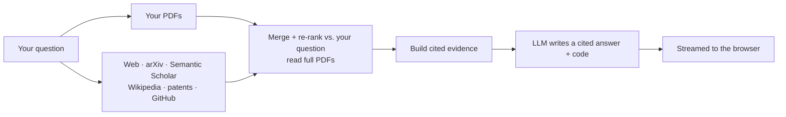

<div align="center">

# 🔊 Audio Research Assistant

**A cited, source-grounded research assistant for audio & speech.**
Ask a question — it searches **your PDFs and the whole web** (research papers, patents,
GitHub, Wikipedia), reads the sources, and answers with **citations and runnable code**.


</div>

---

## ✨ What it does

- 🌐 **Searches everywhere, automatically** — web (DuckDuckGo), research papers
  (arXiv + Semantic Scholar), Wikipedia, patents (Google Patents), and GitHub
  repos/code. **Works with no API key.**
- 📄 **Your own PDFs too** — upload papers; they're parsed, chunked, embedded, and
  searched **together with every external source on every question**, then merged
  and re-ranked so the best evidence wins.
- 🎯 **Grounded & cited** — every claim cites its source (URL · file:line · page).
  It says so plainly when the sources don't cover something.
- 💻 **Reads papers → writes code** — for "how does X work / implement it", it reads
  the method and produces complete, runnable, **original** code or a small simulation.
- ⚡ **Live, interactive UI** — streaming answers, source cards by type, dark mode,
  conversation history, per-message copy/edit/delete. No build step.
- 🔒 **Safe by design** — SSRF-guarded fetches (no localhost/private IPs), timeouts,
  size caps, on-disk caching; API keys stay server-side and are never logged.

---

## 🧠 How it works



| Command | What it does |
|---------|--------------|
| **`python run.py`** | Launch the web app → http://localhost:8600 |
| **`python pipeline.py`** | (Optional) build/refresh the index from local PDFs in `data/papers/` |

---

## 🚀 Quick start

```bash
python -m venv .venv
.\.venv\Scripts\Activate.ps1          # Windows  (source .venv/bin/activate on macOS/Linux)
pip install -r requirements.txt
copy .env.example .env                # then add your keys (see below)
python run.py                         # → http://localhost:8600
```

<details>
<summary><b>🌐 Web-only mode (no database, fastest to deploy)</b></summary>

The simplest setup — no Oracle, no PDFs. In `.env`:
```
ENABLE_LOCAL_RAG=false
ENABLE_WEB_SEARCH=true
OPENAI_API_KEY=sk-...                 # your OpenAI API key
```
Web search runs on free sources (DuckDuckGo, arXiv, Semantic Scholar, Wikipedia,
GitHub) out of the box. Optionally add `TAVILY_API_KEY` for higher-quality web.
</details>

<details>
<summary><b>📄 With your own papers (searched together with the web)</b></summary>

Adds a local PDF library that's searched alongside every web source. In `.env`:
```
ENABLE_LOCAL_RAG=true
ORACLE_DSN=localhost:1521/FREEPDB1    # Oracle 23ai (e.g. in Docker)
GEMINI_API_KEY=...                    # free embeddings: https://aistudio.google.com/apikey
```
Then start your Oracle container and upload PDFs from the sidebar (**＋ Add papers**).
</details>

> The app does not auto-open a browser — visit **http://localhost:8600** yourself.
> It binds to `127.0.0.1` (this PC only).

<details>
<summary><b>Optional Memgraph GraphRAG for your local papers</b></summary>

GraphRAG adds relationship-aware expansion over your indexed PDFs: paper -> chunk
-> concept / section / chunk type. It is useful for comparison and multi-hop
questions, while Oracle remains the source of truth for full text and citations.

```bash
docker run -p 7687:7687 -p 7444:7444 --name memgraph memgraph/memgraph-mage
```

In `.env`:
```
ENABLE_LOCAL_RAG=true
ENABLE_GRAPH_RAG=true
MEMGRAPH_URI=bolt://localhost:7687
```

Build or refresh the graph after indexing PDFs:
```
python -m backend.graph_rag.build_graph
```
</details>

---

## 💬 Using it

1. **Ask** anything in the chat box — answers stream live with a speed badge.
2. **Sources** open in a side drawer, tagged by type — 📄 Paper · 🌐 Web · 🔬 Research ·
   ⚖️ Patent · 🐙 GitHub — each with a clickable link, file path/line, or page.
3. **Add papers** (sidebar) to upload one or more PDFs; the indexed count is shown.
4. **Delete** a paper from **Your papers** — this removes **everything**: the PDF, its
   chunks, embeddings, vectors, concept links, and cached parse.
5. **Switch models** (top bar) and toggle **dark mode**.

---

## 🤖 Autonomous agent (write → run → verify)

Beyond Q&A, the assistant can **solve a problem by actually running code**. Give it a
task and it loops **THINK → EXECUTE → REFLECT**: it designs a Python program, runs it
in a **throwaway Docker sandbox** (no network, capped CPU/memory/time), checks the real
output, and refines until it has the best *verified* solution.

```bash
python -m backend.agent "Find the fastest correct primality test up to 10^7, and benchmark it"
python -m backend.agent --no-search --iters 6 "Implement and compare quicksort vs mergesort on 100k ints"
```

Requirements: **Docker running** + `OPENAI_API_KEY`. It prints each attempt (code, run
result, review) and ends with the best working program, its output, and a one-line answer.
Tune via `.env` (`AGENT_MAX_ITERS`, `AGENT_DOCKER_IMAGE`, `AGENT_RUN_TIMEOUT`, …).

> Safety: the agent executes **AI-generated code**. It only ever runs inside a
> network-less, resource-capped, auto-removed container — never directly on your host.

---

## 🔌 Knowledge sources

| Source | Provider | API key? |
|--------|----------|:--------:|
| Web pages | DuckDuckGo (default) · Tavily / Brave / SerpAPI | ❌ free (key = higher quality) |
| Research papers | arXiv · Semantic Scholar | ❌ free |
| Encyclopedic | Wikipedia | ❌ free |
| Patents | Google Patents | ❌ free |
| Code / repos | GitHub | ❌ free (token raises limits) |
| Your library | Local PDFs → Oracle vector search | needs Oracle + Gemini key |

---

## ⚙️ Configuration (`.env`)

| Variable | Default | Meaning |
|----------|---------|---------|
| `OPENAI_API_KEY` | – | Your OpenAI API key (chat model) |
| `OPENAI_MODEL` | `gpt-5.5` | OpenAI model (e.g. `gpt-5.5-pro`, `gpt-4.1`, `gpt-4o`) |
| `ENABLE_WEB_SEARCH` | `true` | Automatic external search (web/papers/patents/GitHub) |
| `WEB_SEARCH_PROVIDER` | `duckduckgo` | `duckduckgo` (free) · `tavily` · `brave` · `serpapi` |
| `ENABLE_LOCAL_RAG` | `false` | Search your uploaded PDFs first (needs Oracle) |
| `ENABLE_GRAPH_RAG` | `false` | Optional Memgraph expansion across local paper concepts/sections |
| `MEMGRAPH_URI` | `bolt://localhost:7687` | Memgraph Bolt endpoint when GraphRAG is enabled |
| `EMBEDDING_PROVIDER` | `google` | `google` (Gemini) or `local` (sentence-transformers) |
| `ENABLE_AUTH` | `false` | Require login (user_id + password); private per-user chats |
| `ENABLE_AGENTIC_ANSWER_LOOP` | `true` | Web chat drafts, verifies, searches again if needed, then returns the best checked answer |
| `EXTERNAL_TOP_K` · `EVIDENCE_CHARS_PER_SOURCE` · `ANSWER_MAX_TOKENS` | `20` · `3500` · `4096` | Depth/accuracy knobs |

Full list with comments lives in **`.env.example`**. `.env` is gitignored — never commit it.

The web chat uses an **agentic answer loop** by default: search all enabled sources,
draft a grounded answer, verify it against the numbered evidence, search again if
the verifier finds missing support, then return the best checked answer. If the
answer contains fenced Python, the app tries to run it in the same network-less
Docker sandbox used by the CLI agent and includes the run result in verification.

---

## 👥 Team login (optional)

Turn the app into a multi-user tool — members sign in and each gets their **own
private conversations**.

```bash
# 1. Enable it in .env
ENABLE_AUTH=true
AUTH_SECRET_KEY=<python -c "import secrets;print(secrets.token_hex(32))">

# 2. Create accounts (admin)
python -m backend.auth.users add alice      # prompts for a password
python -m backend.auth.users list
python -m backend.auth.users passwd alice   # reset a password
python -m backend.auth.users delete alice
```

Members then visit the app, get redirected to **`/login`**, and sign in. Passwords are
stored salted + hashed (PBKDF2-HMAC-SHA256); the session is a signed cookie. Set
`ENABLE_SIGNUP=true` to let members self-register.

---

## 🛠️ Tech stack

**FastAPI** + Uvicorn (SSE streaming) · vanilla **HTML/CSS/JS** (no build) ·
**Oracle 23ai** native vector search · **Gemini** embeddings · **BAAI bge** cross-encoder
reranker · **Docling** + PyMuPDF parsing · **OpenAI** LLM (GPT-5 family) ·
hybrid retrieval (vector + BM25F + RRF + rerank + MMR + HyDE).

See **[`docs/PIPELINE.md`](docs/PIPELINE.md)** for the full walkthrough and
**[`docs/TECH_STACK.md`](docs/TECH_STACK.md)** for versions.

---

## Claude Code setup

This repo includes a project-specific Claude Code configuration based on the ECC
review and the selected files from `affaan-m/ecc`: root `CLAUDE.md`, focused
local rule overlays, ECC common/python reference rules, five reviewer agents, and
six workflow skills. It deliberately does **not** bulk install ECC, enable
bundled MCPs, or copy generic hook settings. Imported ECC material is MIT
licensed; see `.claude/ECC_LICENSE`.

Security scan:

```bash
npx ecc-agentshield scan
```

Current baseline: Grade A, no critical/high findings.

---

## 🧪 Tests

```bash
pytest                       # fast unit suite — no DB / network / models needed
pyflakes backend webapp      # lint
```

---

<details>
<summary><b>📁 Project structure</b></summary>

```
Audio-research-assistant/
├── run.py                  # launch the web app
├── pipeline.py             # build / refresh the local PDF index
├── backend/
│   ├── external_search/    # web · arXiv · Semantic Scholar · Wikipedia · patents · GitHub
│   ├── graph_rag/          # optional Memgraph graph over local paper chunks/concepts
│   ├── retrieval/          # hybrid_retrieve, vector, fusion, HyDE
│   ├── ingestion/          # parse → chunk → embed → incremental
│   ├── llm/                # streaming_provider (OpenAI)
│   ├── auth/               # user store + password hashing + admin CLI
│   ├── common/ · answering/ · database/ · memory/ · evaluation/
│   └── config.py
├── webapp/                 # FastAPI server + chat_logic + static UI (index.html, app.js, styles.css)
├── scripts/                # admin CLIs: show_accounts · show_data · memory import/export
├── tests/ · docs/ · data/
└── requirements.txt · .env.example · CHANGELOG.md
```
</details>

<div align="center"><sub>Answers are grounded in real sources and cited — built for honest, verifiable research.</sub></div>
