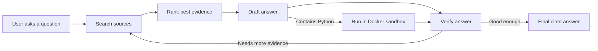
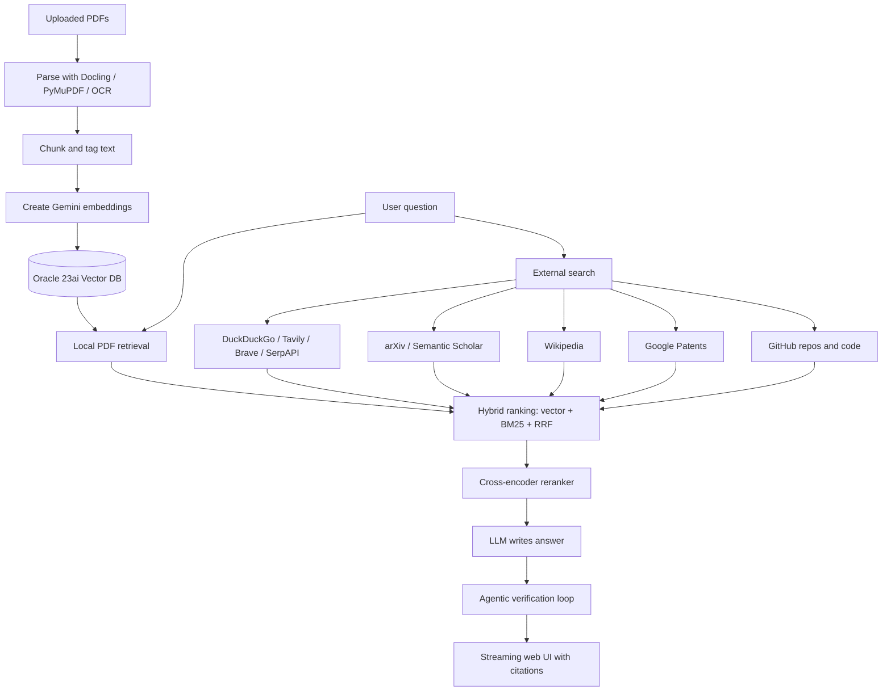
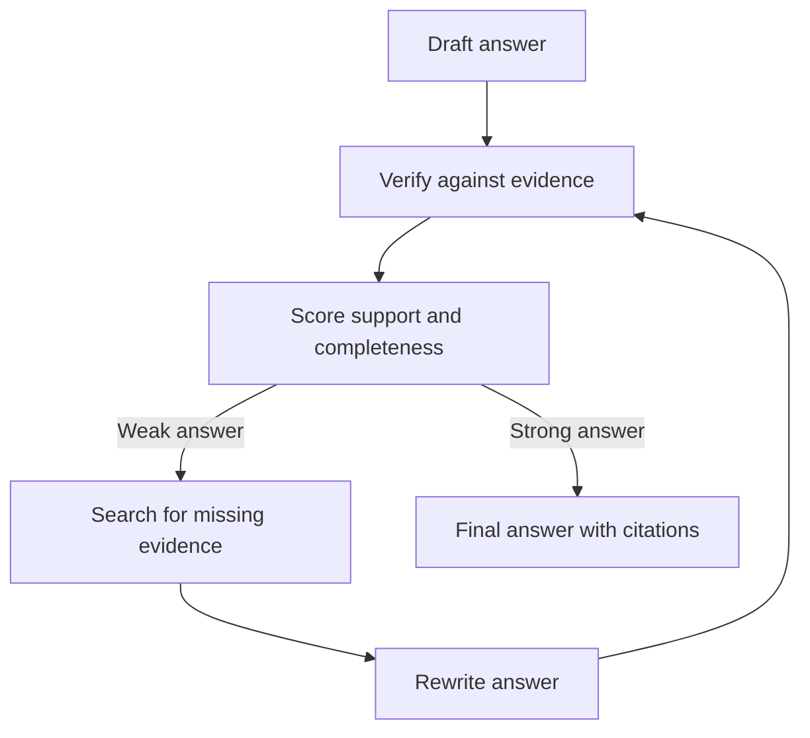

# Claude Prompt: Create An Interactive PDF For Audio Research Assistant

Use this Markdown file as the full brief for generating a polished, easy-to-understand
interactive PDF about the **Audio Research Assistant** project.

Do **not** include any real API keys, passwords, `.env` secret values, private database
credentials, or local user-specific paths in the PDF. Use placeholders only.

---

## Copy This Prompt Into Claude

You are a senior technical writer, visual explainer, and product designer.

Create a complete, beginner-friendly, interactive PDF from the project brief below.
The audience includes teammates, managers, students, and non-engineers who need to
understand what the project does, which tools it uses, and how the system works.

### Output Requirements

- Create a professional PDF-style document with a clickable table of contents.
- Use simple language first, then technical detail.
- Include diagrams, flowcharts, tables, glossary boxes, and "why it matters" callouts.
- Add clickable internal links between sections.
- Add a one-page executive summary at the beginning.
- Add a final "How to run it" quick-start page.
- Add a final "Technology checklist" page.
- Use a clean, modern technical style.
- Do not expose secrets or real `.env` values.
- Show environment variables only as examples with placeholder values.
- Explain every acronym the first time it appears.
- Prefer visual explanations over long paragraphs.

### Suggested Interactive PDF Features

- Clickable table of contents.
- Clickable source/tool cards.
- "Beginner explanation" and "Technical explanation" boxes.
- Pipeline diagram with numbered stages.
- Color-coded sections:
  - Blue: web app
  - Green: retrieval / search
  - Purple: AI models
  - Orange: database / storage
  - Red: safety
- Glossary sidebar for RAG, embedding, vector database, reranker, GraphRAG, SSE.
- Page footer with project name and section title.

---

# Project Brief

## 1. Project Name

**Audio Research Assistant**

## 2. One-Line Summary

Audio Research Assistant is a web-based research assistant that reads PDFs, searches
the web, papers, patents, GitHub, and other sources, then produces grounded answers
with citations and runnable code when needed.

## 3. Simple Explanation

This project works like a technical research helper.

A user asks a question. The system searches relevant knowledge sources, reads the
best evidence, checks the answer, and responds with citations. For implementation
or algorithm questions, it can also write Python code and run it safely inside a
Docker sandbox before giving the final result.

## 4. What Problem It Solves

Researchers and engineers often need to:

- Read many papers quickly.
- Compare methods across papers and websites.
- Understand algorithms.
- Turn research ideas into working code.
- Check claims with citations.
- Search public sources like arXiv, Semantic Scholar, Wikipedia, GitHub, and patents.

This assistant brings those steps into one workflow.

## 5. Main User Workflow



## 6. System Pipeline



## 7. Core Capabilities

| Capability | What It Means |
|-----------|----------------|
| Web chat UI | User asks questions in a browser. |
| PDF ingestion | Upload papers and turn them into searchable text chunks. |
| Local RAG | Search uploaded papers using vector search and keyword search. |
| External search | Search web pages, research papers, patents, Wikipedia, and GitHub. |
| Citations | Answers cite sources with numbered references. |
| Agentic verification | Draft, verify, search again, and refine before final answer. |
| Code simulation | Python code can be run in a locked-down Docker sandbox. |
| GraphRAG | Optional Memgraph knowledge graph connects papers, chunks, and concepts. |
| Multi-user auth | Optional login so each user has private conversations. |
| Model switcher | Choose supported LLM providers/models from the UI. |

## 8. Technology Stack Overview

| Layer | Tools / Technology | Purpose |
|------|--------------------|---------|
| Language | Python 3.11 | Main backend language. |
| Web server | FastAPI | API routes and streaming chat endpoints. |
| ASGI server | Uvicorn | Runs the FastAPI app. |
| Front end | HTML, CSS, vanilla JavaScript | No-build browser UI. |
| Streaming | Server-Sent Events (SSE) | Streams tokens and status updates live. |
| Main database | Oracle Database Free 23ai | Stores papers, chunks, vectors, metadata. |
| Vector search | Oracle native VECTOR column | Finds semantically similar text. |
| Memory | SQLite | Stores conversations, turns, sources, auth data. |
| PDF parser | Docling | High-quality PDF layout and text extraction. |
| Fallback parser | PyMuPDF | Fast fallback if Docling fails. |
| OCR | PaddleOCR / Tesseract optional | Reads scanned/image-only PDFs. |
| Embeddings | Gemini `gemini-embedding-2` | Converts text into vectors. |
| Local embeddings | sentence-transformers optional | Offline embedding option. |
| Reranker | BAAI `bge-reranker-v2-m3` | Re-scores evidence for relevance. |
| Chat LLMs | Gemini, OpenRouter, OpenAI | Generates answers. |
| External search | DuckDuckGo, Tavily, Brave, SerpAPI | Web search providers. |
| Research search | arXiv, Semantic Scholar, Wikipedia | Paper/background sources. |
| Code/repo search | GitHub REST API | Finds repos and code references. |
| GraphRAG | Memgraph + Neo4j Python driver | Optional graph relationship retrieval. |
| Code execution | Docker | Safe sandbox for generated Python. |
| Testing | pytest | Unit test suite. |
| Linting | pyflakes, autoflake, vulture | Code quality checks. |

## 9. AI Model Providers

The project uses one LLM provider interface in `backend/llm/streaming_provider.py`.

Supported providers:

| Provider | Env Provider Name | Notes |
|----------|-------------------|-------|
| Gemini | `gemini` | Uses `GEMINI_API_KEY`; useful free-tier option. |
| OpenRouter | `openrouter` | One key can access DeepSeek, OpenAI, Claude, Qwen, and many models. |
| OpenAI | `openai` | Direct OpenAI API support. |

Example only:

```env
LLM_PROVIDER=openrouter
OPENROUTER_API_KEY=your_key_here
OPENROUTER_MODEL=deepseek/deepseek-chat
```

Do not include real keys in the PDF.

## 10. Retrieval Methods Explained Simply

| Method | Simple Explanation | Why It Helps |
|--------|--------------------|--------------|
| Embeddings | Turns text into numbers that capture meaning. | Finds similar ideas even if words differ. |
| Vector search | Searches by meaning similarity. | Finds conceptually relevant chunks. |
| BM25 | Classic keyword search. | Finds exact terms and acronyms. |
| HyDE | Creates a hypothetical answer to search better. | Improves recall for broad questions. |
| RRF | Combines multiple ranked lists. | Makes ranking more stable. |
| Reranking | Reads query and passage together. | Picks the strongest final evidence. |
| MMR | Balances relevance and diversity. | Avoids repeated near-duplicate sources. |
| GraphRAG | Uses relationships between concepts/chunks. | Helps multi-hop and comparison questions. |

## 11. External Sources

The assistant can gather evidence from:

- Uploaded local PDFs.
- Web pages.
- Online PDFs.
- arXiv papers.
- Semantic Scholar papers.
- Wikipedia.
- Google Patents.
- GitHub repositories.
- GitHub code files when a token is available.

The system prefers grounded evidence and should say when sources do not support an answer.

## 12. Answer Generation And Verification

The answering system is not just "ask model once."

It can run a loop:



Verification checks:

- Does the answer cite sources?
- Are important claims supported?
- Is anything missing?
- Does generated Python run successfully?
- Is more search needed?

## 13. Code Execution Safety

For coding tasks, the assistant may generate Python code.

Generated code is not run directly on the host machine. It is run inside a Docker
container with safety limits:

- No direct host execution.
- Networkless sandbox.
- CPU limit.
- Memory limit.
- Timeout.
- Auto-removed container.

This allows the system to verify code output while reducing risk.

## 14. Web App Features

| Feature | Description |
|---------|-------------|
| Streaming answers | Tokens appear live as the answer is generated. |
| Source drawer | Users can inspect cited evidence. |
| Citation chips | Numbered citations link claims to sources. |
| Model selector | Switch between configured model providers. |
| Dark mode | UI supports theme switching. |
| Conversation history | Sessions and turns are stored. |
| PDF upload | Users can add research papers. |
| Agent mode | Coding tasks can run write -> execute -> verify loops. |
| Login | Optional multi-user login with private conversations. |

## 15. Data Storage

| Storage | What It Stores |
|---------|----------------|
| Oracle 23ai | Papers, chunks, metadata, embeddings, vector search columns. |
| SQLite | Conversations, turns, saved sources, auth/user data. |
| File system | Uploaded PDFs, extracted text, parser cache, logs. |
| Memgraph optional | Concept/chunk/paper relationship graph. |

## 16. Security And Privacy

Important safety rules:

- API keys live only in `.env`.
- `.env` must not be committed.
- SSRF guard blocks private/internal network fetches by default.
- External fetches have timeout and size limits.
- Generated Python runs inside Docker, not directly on the host.
- Public sharing should require auth.
- `EXTERNAL_ALLOW_UNSAFE_URLS=true` is for trusted local development only.

PDF should include a red warning box:

> Never publish `.env`, API keys, database passwords, or local private data.

## 17. Main Commands

| Command | Purpose |
|---------|---------|
| `python run.py` | Start the local web app at `http://localhost:8600`. |
| `python run.py --port 9000` | Start on a different local port. |
| `python pipeline.py` | Build or refresh the local PDF index. |
| `python pipeline.py --incremental` | Index only changed PDFs. |
| `python -m backend.graph_rag.build_graph` | Build optional Memgraph graph. |
| `python -m backend.agent "task"` | Run autonomous code agent from CLI. |
| `python -m pytest -q` | Run tests. |
| `pyflakes backend webapp` | Lint backend and web app code. |

## 18. Environment File Structure

The project keeps runtime configuration in `.env`.

Recommended `.env` sections:

1. App Runtime
2. Auth
3. Database / Local PDF RAG
4. Chat LLM
5. Embeddings / Reranking
6. Knowledge Sources
7. Answer Verification
8. Device
9. PDF Ingestion

Example placeholder:

```env
LLM_PROVIDER=gemini
GEMINI_API_KEY=your_key_here
GEMINI_MODEL=gemini-2.5-flash

ENABLE_WEB_SEARCH=true
ENABLE_LOCAL_RAG=false
```

Again: do not include real keys.

## 19. Project Folder Structure

```text
Audio-research-assistant/
|-- run.py                  # local web launcher
|-- pipeline.py             # local PDF index builder
|-- backend/                # server-side Python code
|-- webapp/                 # FastAPI app and static browser UI
|-- tests/                  # pytest tests
|-- scripts/                # admin/operator scripts
|-- docs/                   # architecture and project docs
|-- data/                   # local runtime data, caches, papers, logs
|-- .env.example            # public-safe config template
|-- requirements.txt        # Python dependencies
```

Important backend folders:

| Folder | Purpose |
|--------|---------|
| `backend/agent/` | Code-writing agent and Docker sandbox runner. |
| `backend/answering/` | Answer drafting, verification, reviewer logic. |
| `backend/external_search/` | Web, papers, patents, GitHub, online PDF search. |
| `backend/graph_rag/` | Optional Memgraph graph retrieval. |
| `backend/ingestion/` | PDF parsing, chunking, embedding, indexing. |
| `backend/llm/` | LLM provider interface. |
| `backend/retrieval/` | Hybrid local retrieval. |
| `backend/memory/` | Conversation memory and backup. |

## 20. Suggested PDF Page Plan

1. Cover page.
2. Executive summary.
3. What problem this solves.
4. One-picture system overview.
5. User workflow.
6. Technology stack.
7. Source search map.
8. Local PDF RAG pipeline.
9. Answer verification loop.
10. Code execution safety.
11. Database and storage.
12. UI features.
13. Configuration and environment variables.
14. Security and privacy.
15. How to run.
16. Glossary.
17. Technology checklist.

## 21. Glossary

| Term | Easy Meaning |
|------|--------------|
| RAG | Retrieval-Augmented Generation: answer using searched evidence. |
| Embedding | A numeric meaning fingerprint for text. |
| Vector database | A database that searches by meaning similarity. |
| Chunk | A smaller section of a document used for search. |
| Reranker | A model that chooses the best evidence after search. |
| GraphRAG | Retrieval that also uses relationships between concepts. |
| SSE | Server-Sent Events: browser receives live streamed updates. |
| OCR | Optical Character Recognition: extracts text from scanned images. |
| SSRF | Server-Side Request Forgery: unsafe fetching of internal/private URLs. |
| Sandbox | A restricted environment for safely running code. |

## 22. Design Tone

Make the PDF feel:

- Clear.
- Modern.
- Practical.
- Trustworthy.
- Easy for non-engineers.
- Detailed enough for engineers.

Avoid making it look like raw documentation. It should feel like a polished
technical product explainer.

## 23. Final Reminder For Claude

Before producing the PDF, check that:

- No secrets are included.
- Every diagram has a short caption.
- Every technical term has a simple explanation.
- The first three pages can be understood by a non-engineer.
- The later pages have enough detail for developers.

