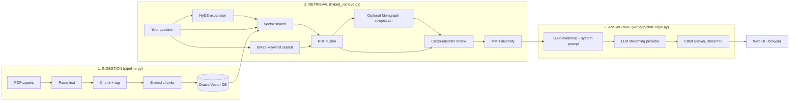
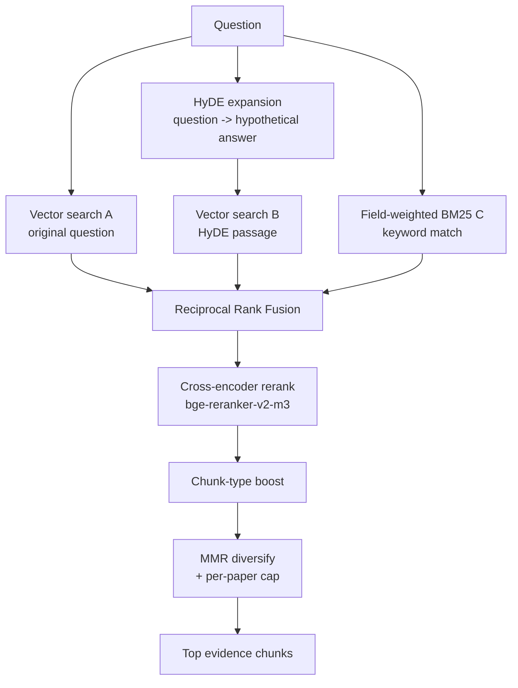
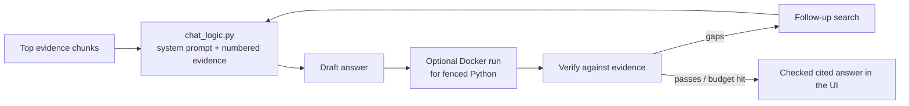
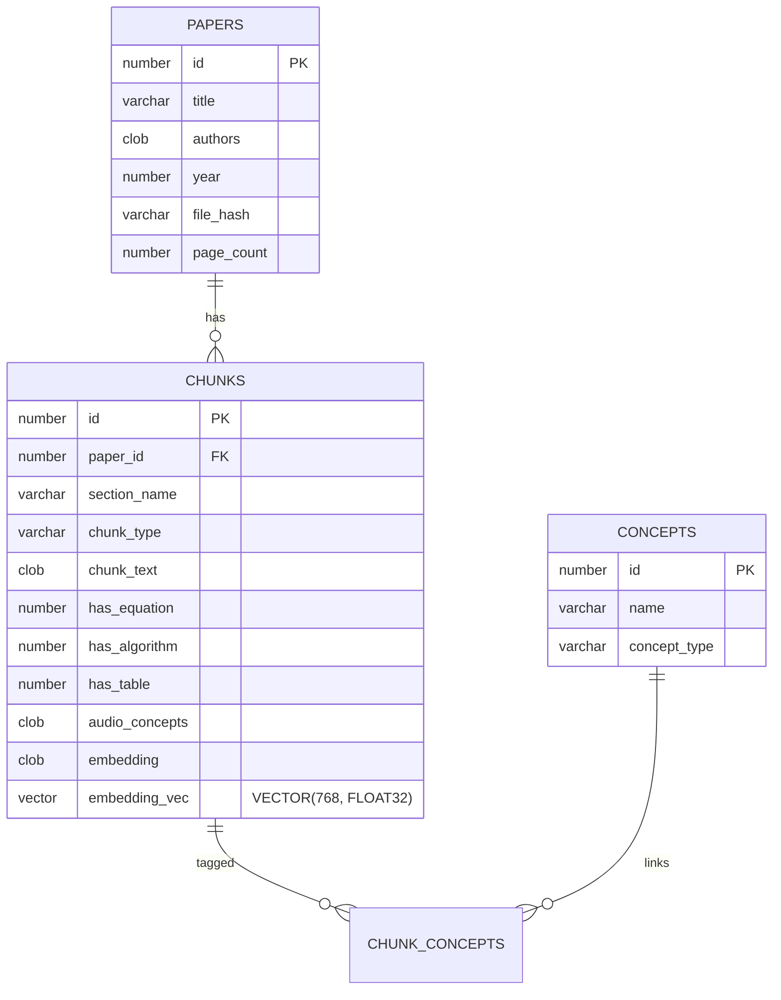

# Audio Research Assistant — Pipeline & Technology Guide

> A plain-English + technical walkthrough of how this project works end to end,
> the tools it uses, and why. Written so anyone — engineer or not — can follow
> the flow. Kept in sync with the code; see `CHANGELOG.md` for what changed when.

---

## 1. What this project is

The **Audio Research Assistant** is a **RAG** (Retrieval-Augmented Generation)
system for **audio / speech-enhancement research papers**.

You give it a folder of PDFs (papers on beamforming, noise suppression, echo
cancellation, dereverberation, etc.). It reads them, stores them in a searchable
**vector database**, and answers your technical questions **using only those
papers**, with citations back to the exact source.

> **Upload papers → the system indexes them → you ask questions → it retrieves the
> most relevant evidence and writes a cited, grounded answer.**

It is built to *not hallucinate*: every answer is grounded in retrieved evidence,
and it says so plainly when the papers don't cover something.

---

## 2. The big picture



The project has **two commands** that map onto this picture:

| Command | Covers | What it does |
|---------|--------|--------------|
| `python pipeline.py` | Stage 1 | Builds / refreshes the search index from PDFs |
| `python run.py` | Stages 2–3 | Launches the web app you ask questions in (http://localhost:8600) |

---

## 3. Stage 1 — Ingestion (building the index)

**Goal:** turn raw PDFs into searchable, embedded, tagged chunks in the database.
Run with `python pipeline.py`. It executes three sub-steps in order (each as
`python -m backend.<module>` from the project root).


### 3.1 Parse — `backend/ingestion/pdf_parser.py`
Extracts clean text from each PDF (a one-time cost at upload — it does **not**
affect answer speed):

- **Docling** — the parser. IBM's document AI: layout analysis, reading order,
  tables, and section structure → high-quality chunks for scientific papers.
  Runs on the GPU (CUDA) when available.
- **PyMuPDF (`fitz`)** — automatic fallback if Docling errors on a file, so
  ingestion never hard-fails.
- **OCR fallback** (`ocr_fallback.py`) — only when a page has almost no
  extractable text (scanned / image-only PDF): PaddleOCR / Tesseract.

### 3.2 Chunk + tag — `backend/ingestion/document_chunker.py`
Splits each paper into **semantically meaningful chunks** rather than blind
fixed-size slices. For every chunk it detects and stores: the **section name**,
**chunk type** (prose / caption / algorithm block), **flags** (`has_equation`,
`has_algorithm`, `has_table`), and **audio concepts** (MVDR, MUSIC, SRP-PHAT,
STFT, PESQ, STOI, …) — all high-signal for retrieval.

### 3.3 Embed — `backend/ingestion/embed_chunks.py`
Converts each chunk into a **768-dimensional vector** (a numeric fingerprint of
its meaning). The backend is set by `EMBEDDING_PROVIDER`:

- **`google`** (default) — Google **Gemini Embedding** (`gemini-embedding-2`,
  free tier, 768-dim, L2-normalized). One embedding per request, parallelized
  with a thread pool (`EMBED_CONCURRENCY`). Frees the GPU entirely. Documents are
  embedded with light structure — `title: … | section: … | concepts: … | text: …`
  — and queries as `task: question answering | query: …`, which improves
  query↔document matching.
- **`local`** — a `sentence-transformers` model (e.g. `BAAI/bge-base-en-v1.5`)
  on the GPU (raw text, no formatting).

### 3.4 Vector migration — `backend/database/vector_migration.py`
Writes the embeddings into Oracle's **native `VECTOR` column**
(`embedding_vec VECTOR(768, FLOAT32)`). Search uses **exact COSINE** distance by
default (no index needed — correct and reliable for this corpus size). An
approximate vector index (HNSW/IVF) is **opt-in** via `CREATE_VECTOR_INDEX=true`.

> Incremental mode: `python pipeline.py --incremental` only re-processes PDFs
> whose content hash changed (`incremental_index.py`), so re-runs are cheap.
> `python pipeline.py --status` shows what's indexed without rebuilding.

---

## 4. Stage 2 — Retrieval (finding the right evidence)

**Goal:** given your question, find the most relevant chunks across all papers.
This is the heart of the system — a **hybrid, multi-signal retriever**
(`backend/retrieval/hybrid_retrieve.py`).



Step by step:

1. **HyDE expansion** (`hyde_generator.py`) — rewrites the question into a short
   *hypothetical answer passage* (template + lexicon based, no LLM/API call).
   Embedding a passage-shaped text retrieves better than embedding a bare
   question. *(HyDE = Hypothetical Document Embeddings, Gao et al. 2022.)*
2. **Three parallel rankings:**
   - **A — Vector search** on the original question (Oracle `VECTOR_DISTANCE … COSINE`).
   - **B — Vector search** on the HyDE passage.
   - **C — Field-weighted BM25** (`retrieval_fusion.py`) — keyword search where
     title / concepts / section count more than body text (BM25F-style).
3. **RRF fusion** (`retrieval_fusion.py`) — **Reciprocal Rank Fusion** merges the
   three rankings by *rank* (robust to mismatched score scales). `RRF_K = 60`.
4. **Cross-encoder rerank** — the top candidates are re-scored against the
   original question by **`BAAI/bge-reranker-v2-m3`** (reads query + chunk
   together for a precise relevance score). Device set by `RERANKER_DEVICE`.
5. **Chunk-type boost** — nudges figure/table captions and algorithm blocks up.
6. **MMR diversification** (`retrieval_fusion.py`) — **Maximal Marginal
   Relevance** trades relevance against redundancy and enforces a **per-paper
   cap**, so you don't get five near-duplicate chunks. `MMR_LAMBDA = 0.7`.

**Optional Memgraph GraphRAG** (`backend/graph_rag/`) can be enabled with
`ENABLE_GRAPH_RAG=true` after local PDFs are indexed. The graph is built from
Oracle papers, chunks, sections, chunk types, and detected concepts. During
retrieval, fused local chunks become seed nodes; Memgraph expands to related
Oracle chunks through shared concepts, sections, papers, and concept
co-occurrence. It never returns graph-only evidence: every graph hit maps back to
an Oracle chunk/page before reranking and citation.

**Single optimized retrieval mode** (`research_modes.py` → `DEFAULT_RETRIEVAL_SETTINGS`)
— there are no Fast / Balanced / Deep options. The app always runs **one config
tuned for high accuracy with good speed** (vector/BM25/rerank top-k = 24,
≤ 2 sources per paper, up to 12 sources). Nothing to choose in the UI; the number
of sources used is then selected adaptively by relevance per question.

---

## 5. Stage 3 — Answering (writing the grounded reply)

**Goal:** turn the retrieved evidence into a clear, cited answer, streamed live
to the browser. This is orchestrated by **`webapp/chat_logic.py`**.



1. **Build the prompt** — `chat_logic.py` formats the retrieved chunks as numbered
   `[1] … [N]` evidence blocks and pairs them with a strict **system prompt** that
   forces the model to answer using **only** that evidence and cite every
   non-trivial claim. Recent conversation turns are included for context.
2. **Pick the model** — `streaming_provider.get_provider()` returns the active LLM
   based on `LLM_PROVIDER` in `.env` (see §6). The user can switch models live in
   the top-right **Model** dropdown (`webapp/settings.py`).
3. **Stream the answer** — tokens are streamed from the provider straight to the
   browser over **Server-Sent Events** (newline-delimited JSON). The UI renders
   markdown live, turns `[n]` into clickable **citation chips**, and shows the
   **source cards** in a side drawer.
4. **Persist the turn** — the question, answer, and its sources are saved to the
   conversation store (`backend/memory/store.py`) so history survives a refresh.
   Each question supports **copy / edit-and-resend / delete** in the UI.

Current default: before the final answer is emitted, `backend/answering/agentic_answer.py`
runs a bounded draft -> verify -> refine loop (`ENABLE_AGENTIC_ANSWER_LOOP=true`).
The verifier checks evidence support, citation use, and completeness. If it finds
missing support, the app searches local PDFs plus web/research/patents/GitHub again
with a follow-up query and rewrites against the expanded evidence. If the draft
contains fenced Python, the longest block is run in the existing network-less
Docker sandbox and that run result is included in verification.

---

## 6. LLM providers (chat models)

All answer generation goes through one interface,
`backend/llm/streaming_provider.py`, backed by **OpenAI**. Configure with
`OPENAI_API_KEY` in `.env`; switch the model live in the UI.

| Setting | Value | Notes |
|---------|-------|-------|
| `OPENAI_API_KEY` | `sk-…` | Your OpenAI key (required). |
| `OPENAI_MODEL` | `gpt-4o` (default) | e.g. `gpt-4o-mini`, `gpt-4.1`, `gpt-4.1-mini`. |
| `OPENAI_BASE_URL` | *(optional)* | Only for Azure OpenAI or an OpenAI-compatible proxy. |

To measure which model answers best, use
`python -m backend.evaluation.evaluate_llm --models "openai:gpt-4o,openai:gpt-4o-mini"`.

---

## 7. Supporting capabilities

| Capability | Module | What it does |
|------------|--------|--------------|
| **Conversation memory** | `backend/memory/store.py` | Three-tier memory in SQLite (`data/memory.db`): sessions, turns (with saved sources), and facts. Supports edit/delete of individual turns. |
| **Memory backup** | `backend/memory/memory_backup.py` | Human-readable, checksummed, secret-masked export/import of memory (used by `scripts/`). |
| **Optional GraphRAG** | `backend/graph_rag/` | Builds a Memgraph graph from Oracle papers/chunks/concepts and expands local retrieval through relationships. |
| **Retrieval evaluation** | `backend/evaluation/evaluate_retrieval.py` | Scores retrieval quality against `data/evaluation_questions.json`. |
| **LLM accuracy** | `backend/evaluation/evaluate_llm.py` | Scores/compares LLM answer accuracy (keypoint coverage, citation rate, optional LLM-judge) against `data/llm_eval_questions.json`. |
| **Data viewer** | `scripts/show_data.py` | Inspect indexed PDFs, chunks, embeddings, and memory. |

---

## 8. Technology stack

### Core
| Technology | Role |
|------------|------|
| **Python 3.11** | Language |
| **FastAPI + Uvicorn** | Web server + Server-Sent-Events streaming |
| **HTML / CSS / vanilla JS** | Front end — **no build step** (`webapp/static/`) |
| **Oracle Database Free (23ai)** | Relational store **+ native vector search** (Docker) |
| **python-oracledb** | Oracle driver |
| **Memgraph** *(optional)* | GraphRAG relationship expansion over local paper chunks |

### AI / ML
| Technology | Role |
|------------|------|
| **Gemini Embedding** (`gemini-embedding-2`) | Default embedding model (768-dim, Google API) |
| **BAAI/bge-base-en-v1.5** | Local embedding alternative (`EMBEDDING_PROVIDER=local`) |
| **BAAI/bge-reranker-v2-m3** | Cross-encoder reranker |
| **PyTorch / sentence-transformers / transformers** | Run the reranker (and local embeddings) on GPU/CPU |
| **OpenAI SDK** | Client for the OpenAI chat API (streaming answers) |

### Document processing
| Technology | Role |
|------------|------|
| **Docling** | The PDF parser — best-quality layout/table/structure extraction |
| **PyMuPDF (fitz)** | Fast fallback parser (if Docling errors) |
| **PaddleOCR / Tesseract** *(optional)* | OCR for scanned PDFs |

### Retrieval techniques (concepts)
| Technique | Where | Why |
|-----------|-------|-----|
| **Vector / semantic search** | Oracle `VECTOR_DISTANCE COSINE` | Meaning-based matching |
| **BM25F** (field-weighted keyword) | `retrieval_fusion.py` | Exact-term matching |
| **RRF** (Reciprocal Rank Fusion) | `retrieval_fusion.py` | Merge multiple rankers robustly |
| **HyDE** (Hypothetical Doc Embeddings) | `hyde_generator.py` | Better recall from questions |
| **Cross-encoder reranking** | `hybrid_retrieve.py` | Precise final ordering |
| **MMR** (Maximal Marginal Relevance) | `retrieval_fusion.py` | Diverse, non-redundant evidence |

---

## 9. Data model (Oracle)



---

## 10. Configuration (`.env`)

Everything is configured via a single `.env` file (copy `.env.example`). Key
settings:

| Variable | Example | Meaning |
|----------|---------|---------|
| `ORACLE_DSN` | `localhost:1521/FREEPDB1` | Oracle connection |
| `OPENAI_API_KEY` | `sk-…` | OpenAI key (chat model; see §6) |
| `OPENAI_MODEL` | `gpt-4o` | OpenAI model |
| `EMBEDDING_PROVIDER` | `google` \| `local` | Embedding backend |
| `EMBEDDING_MODEL` | `gemini-embedding-2` | Embedding model |
| `GEMINI_API_KEY` | `…` | Free key for Google embeddings (aistudio.google.com) |
| `RERANKER_MODEL` | `BAAI/bge-reranker-v2-m3` | Reranker |
| `EMBEDDING_DIM` | `768` | Vector dimension |
| `DEVICE` / `EMBEDDING_DEVICE` / `RERANKER_DEVICE` | `auto` / `cuda` / `cpu` | GPU/CPU placement |
| `MAX_QUERY_ROUTES`, `RETRIEVAL_TOP_K`, `TOTAL_SOURCE_LIMIT` | `4 / 8 / 14` | Retrieval tuning |
| `ENABLE_OCR` | `true` | OCR fallback for scanned PDFs |
| `CREATE_VECTOR_INDEX` | `false` | Opt in to an approximate HNSW/IVF vector index |
| `ENABLE_GRAPH_RAG` | `false` | Opt in to optional Memgraph expansion over local PDFs |
| `MEMGRAPH_URI` | `bolt://localhost:7687` | Memgraph Bolt endpoint |

> Embeddings use the Gemini API by default, so the GPU is free for the reranker
> and Docling. `DEVICE=cuda` runs everything local on the GPU.

---

## 11. How to run

```powershell
# 0. Start the Oracle database (Docker)
docker start oracle-ai-db

# 1. Build / refresh the index from data/papers/  (only when PDFs change)
python pipeline.py                 # full rebuild
python pipeline.py --incremental   # only changed PDFs
python pipeline.py --status        # show what's indexed (no rebuild)

# Optional: build the Memgraph graph after local PDF indexing
python -m backend.graph_rag.build_graph

# 2. Launch the web app  ->  http://localhost:8600
python run.py                      # local to this PC
python run.py --port 9000          # optional: choose another local port
```

Useful checks:
```powershell
python -m backend.database.test_oracle    # verify DB connection
python -m backend.database.db_status       # show indexed papers / chunks
```

---

## 12. Project structure (where things live)

```
Audio-research-assistant/
├── run.py                  # Launch the local web app (auto-frees stale Python servers)
├── pipeline.py             # Build / refresh the index (ingest -> embed -> vector)
├── backend/
│   ├── config.py           # Central settings (reads .env)
│   ├── common/             # device (GPU/CPU), embeddings (Gemini/local)
│   ├── ingestion/          # pdf_parser, ocr_fallback, document_chunker,
│   │                       #   ingest_papers, embed_chunks, incremental_index
│   ├── graph_rag/          # optional Memgraph graph expansion
│   ├── retrieval/          # hybrid_retrieve, vector_retriever,
│   │                       #   retrieval_fusion, hyde_generator
│   ├── answering/          # research_modes, query_sanity
│   ├── llm/                # streaming_provider (all chat providers)
│   ├── database/           # vector_migration + DB admin scripts
│   ├── memory/             # store (conversation memory), memory_backup
│   └── evaluation/         # evaluate_retrieval
├── webapp/                 # the web UI
│   ├── server.py           #   FastAPI routes + streaming chat (SSE)
│   ├── chat_logic.py       #   retrieval + LLM + memory orchestration
│   ├── ingest.py           #   PDF upload + live ingestion
│   ├── settings.py         #   model switcher
│   └── static/             #   index.html, app.js, styles.css (no build)
├── scripts/                # admin CLIs: show_accounts, show_data, memory import/export
├── tests/                  # pytest unit tests
├── data/                   # papers, extracted text, memory.db (gitignored)
└── docs/                   # this guide + reference PDF
```

---

## 13. Glossary

| Term | Meaning |
|------|---------|
| **RAG** | Retrieval-Augmented Generation — answer using retrieved documents, not just model memory. |
| **Embedding** | A list of numbers representing the meaning of text, so similar meanings sit close together. |
| **Vector database** | A database that finds items by *meaning similarity* between embeddings. |
| **Chunk** | A small, self-contained passage of a paper that gets embedded and retrieved. |
| **BM25 / BM25F** | A classic keyword-relevance formula; BM25F weights some fields higher. |
| **RRF** | Reciprocal Rank Fusion — combines several ranked lists into one by rank position. |
| **HyDE** | Turns a question into a fake answer passage to improve vector-search recall. |
| **Cross-encoder** | A model that reads the query and a candidate *together* to score relevance precisely. |
| **MMR** | Maximal Marginal Relevance — picks results that are relevant *and* diverse. |
| **SSE** | Server-Sent Events — the server streams the answer to the browser token by token. |

---

*Reflects the codebase after the dead-code cleanup (see `CHANGELOG.md`). Runs
against Oracle 23ai (Docker), FastAPI web UI on port 8600.*
