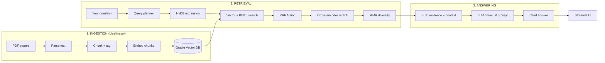
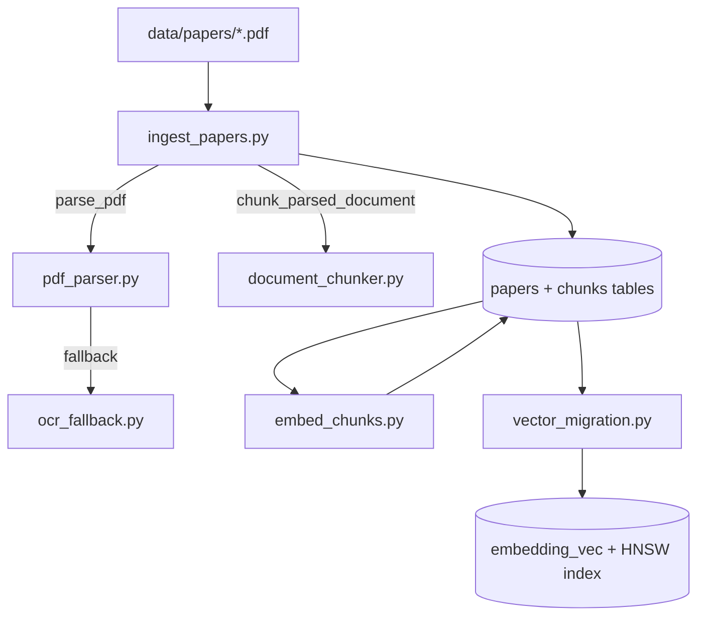
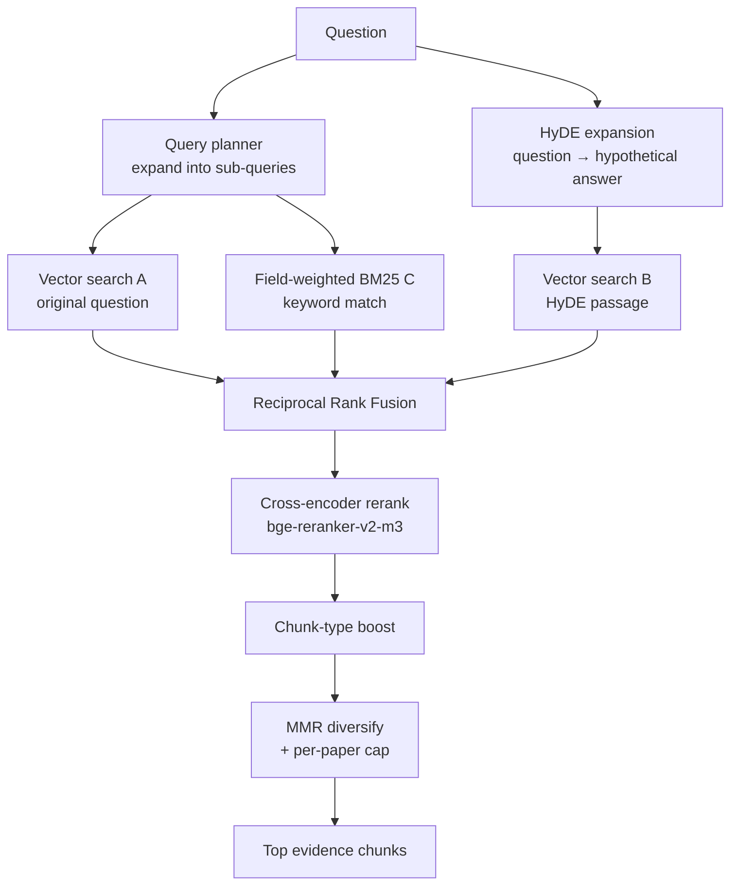
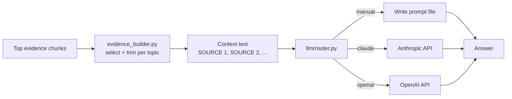
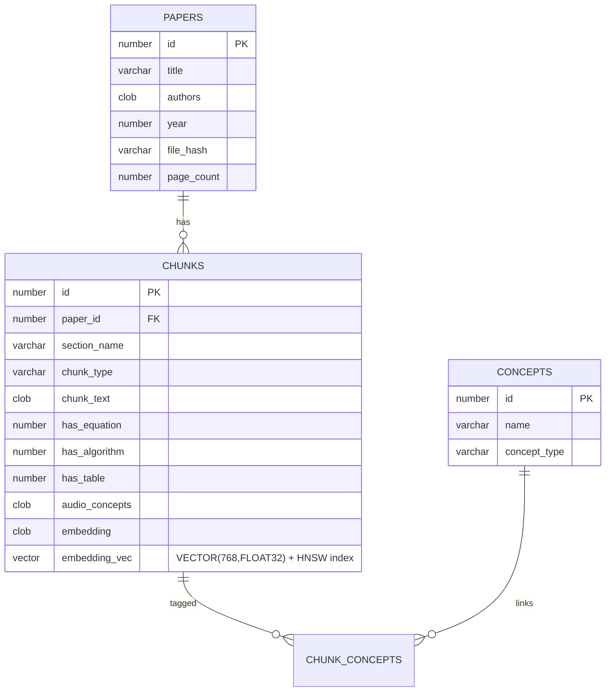

# Audio Research Assistant — Pipeline & Technology Guide

> A plain-English + technical walkthrough of how this project works end to end,
> the tools and technologies it uses, and why. Written so anyone — engineer or
> not — can follow the flow.

---

## 1. What this project is

The **Audio Research Assistant** is a **RAG** (Retrieval-Augmented Generation)
system for **audio / speech-enhancement research papers**.

You give it a folder of PDFs (papers on beamforming, noise suppression, echo
cancellation, dereverberation, etc.). It reads them, understands them, stores
them in a searchable **vector database**, and then answers your technical
questions **using only those papers**, with citations back to the exact source.

In one sentence:

> **Upload papers → the system indexes them → you ask questions → it retrieves the
> most relevant evidence and writes a cited, grounded answer.**

It is built to *not hallucinate*: every answer is grounded in retrieved evidence
from your uploaded papers, and it says so explicitly when the papers don't cover
something.

---

## 2. The big picture



The project has **two commands** that map onto this picture:

| Command | Covers | What it does |
|---------|--------|--------------|
| `python pipeline.py` | Stage 1 | Builds / refreshes the search index from PDFs |
| `python run.py` | Stages 2–3 | Launches the web app you ask questions in |

---

## 3. Stage 1 — Ingestion (building the index)

**Goal:** turn raw PDFs into searchable, embedded, tagged chunks in the database.
Run with `python pipeline.py`. It executes three sub-steps in order.



### 3.1 Parse — `backend/ingestion/pdf_parser.py`
Extracts clean text from each PDF, page by page. It supports several parser
engines selected by `PARSER_MODE`:

- **PyMuPDF (`fitz`)** — fast default text extraction.
- **Docling** *(optional)* — high-quality structured parsing (layout, tables).
- **Marker** *(optional)* — alternative deep PDF→markdown parser.
- **OCR fallback** (`ocr_fallback.py`) — when a PDF is scanned/image-only, falls
  back to OCR (PaddleOCR / Tesseract) so no paper is lost.

Text is cleaned (de-hyphenation, whitespace normalization) before chunking.

### 3.2 Chunk + tag — `backend/ingestion/document_chunker.py`
Splits each paper into **semantically meaningful chunks** rather than blind
fixed-size slices. For every chunk it detects and stores:

- **Section name** (~45 patterns: Abstract, Method, Network Architecture, Loss
  Function, Ablation Study, Datasets, Results, Limitations, …).
- **Chunk type** — prose, **figure/table caption**, or **algorithm block**
  (algorithms and captions are kept whole because they pack method names + metric
  values, which are high-signal for retrieval).
- **Flags** — `has_equation`, `has_algorithm`, `has_table`.
- **Audio concepts** — domain terms found in the chunk (MVDR, MUSIC, ESPRIT,
  SRP-PHAT, NLMS, RLS, STFT, Mel, ERB, GRU, LSTM, U-Net, PESQ, STOI, ERLE, …).

### 3.3 Embed — `backend/ingestion/embed_chunks.py`
Converts each chunk's text into a **768-dimensional vector** (a numeric
fingerprint of its meaning) using the embedding model **`BAAI/bge-base-en-v1.5`**
via `sentence-transformers`. Runs on the **GPU** by default.

### 3.4 Vector migration — `backend/database/vector_migration.py`
Moves the embeddings into Oracle's **native `VECTOR` column** (`embedding_vec
VECTOR(768, FLOAT32)`) and builds an **HNSW vector index** for fast approximate
nearest-neighbour search. This is what makes semantic search instant.

> Incremental mode: `python pipeline.py --incremental` only re-processes PDFs
> whose content hash changed (`incremental_index.py`), so re-runs are cheap.

---

## 4. Stage 2 — Retrieval (finding the right evidence)

**Goal:** given your question, find the most relevant chunks across all papers.
This is the heart of the system — a **hybrid, multi-signal retriever**
(`backend/retrieval/hybrid_retrieve.py`).



Step by step:

1. **Query planning** (`query_planner.py`) — expands your question into several
   focused sub-queries using a domain lexicon (e.g. "noise" → noise suppression,
   denoising, SNR, …). Up to `MAX_QUERY_ROUTES` routes.
2. **HyDE expansion** (`hyde_generator.py`) — rewrites the question into a short
   *hypothetical answer passage* (no LLM/API needed; template + lexicon based).
   Embedding a passage-shaped text retrieves better than embedding a bare
   question. *(HyDE = Hypothetical Document Embeddings, Gao et al. 2022.)*
3. **Three parallel rankings:**
   - **A — Vector search** on the original question (Oracle `VECTOR_DISTANCE …
     COSINE`).
   - **B — Vector search** on the HyDE passage.
   - **C — Field-weighted BM25** (`retrieval_fusion.py`) — keyword search where
     title / concepts / section count more than body text (BM25F-style).
4. **RRF fusion** (`retrieval_fusion.py`) — **Reciprocal Rank Fusion** merges the
   three rankings by *rank* (robust to mismatched score scales). `RRF_K = 60`.
5. **Cross-encoder rerank** — the top candidates are re-scored against the
   original question by **`BAAI/bge-reranker-v2-m3`** (a cross-encoder that reads
   query + chunk together for a precise relevance score). Runs on **CPU** by
   default to save GPU memory.
6. **Chunk-type boost** — nudges figure/table captions and algorithm blocks up.
7. **MMR diversification** (`retrieval_fusion.py`) — **Maximal Marginal
   Relevance** trades relevance against redundancy so you don't get five
   near-duplicate chunks, and enforces a **per-paper cap**. `MMR_LAMBDA = 0.7`.

**Research modes** (`research_modes.py`) — *Fast / Balanced / Deep* presets tune
all of the above (how many routes, sources, top-k, per-paper cap) for speed vs.
thoroughness.

---

## 5. Stage 3 — Answering (writing the grounded reply)

**Goal:** turn the retrieved evidence into a clear, cited answer.



1. **Evidence building** (`answering/evidence_builder.py` + `prompt_quality.py`)
   — picks the strongest chunks per topic, drops weak sections (references,
   acknowledgements, appendix), trims to `TOTAL_SOURCE_LIMIT`, and formats them as
   numbered `[SOURCE 1] … [SOURCE N]` blocks. `answer_orchestrator.py` ties the
   steps together and saves `latest_context.txt` / `latest_answer.txt`.
2. **Answer routing** (`backend/llm/router.py`) — a strict system prompt forces
   the model to use **only** the retrieved evidence and cite every technical
   claim. `ANSWER_PROVIDER` selects the backend:
   - **`manual`** — writes the full prompt to a file (no API cost; paste into any
     chat model). *This is the current default.*
   - **`claude`** — calls the **Anthropic** API (Claude).
   - **`openai`** — calls the **OpenAI** API.
3. **Chat model** (chat UI) — the conversational UI additionally uses
   `backend/llm/multi_provider.py`, a provider abstraction over **OpenAI** and a
   local **Ollama** model (`qwen2.5:7b-instruct`) with automatic fallback.

---

## 6. Supporting capabilities

| Capability | Module | What it does |
|------------|--------|--------------|
| **Conversation memory** | `memory/store.py` | Three-tier memory in SQLite (`data/memory.db`); remembers chats & facts. Thread-safe for Streamlit. |
| **Memory backup** | `memory/memory_io.py` | Human-readable, checksummed, secret-masked export/import of memory to `.tar.gz`. |
| **Cost tracking** | `llm/cost_tracker.py` | Logs every paid API call (tokens + USD) to `data/llm_costs.db`. |
| **Web search** | `tools/web_search.py` | Finds *external* papers via **arXiv** + **Semantic Scholar** (free, no key). |
| **Code sandbox** | `tools/code_executor.py` + `sandbox_runner.py` | Runs LLM-written Python in a locked-down subprocess (import allowlist, timeout, no file/network). |
| **DSP toolkit** | `tools/dsp_toolkit.py` | Pre-verified DSP functions (MVDR, delay-and-sum, MUSIC, SRP-PHAT, steering vectors…) the model can call instead of re-deriving math. |
| **Retrieval evaluation** | `evaluation/evaluate_retrieval.py` | Scores retrieval quality against `data/evaluation_questions.json`. |

---

## 7. Technology stack

### Core
| Technology | Version | Role |
|------------|---------|------|
| **Python** | 3.11 | Language |
| **Streamlit** | 1.57 | Web UI (chat, market, dashboard) |
| **Oracle Database Free (23ai)** | latest (Docker) | Relational store **+ native vector search** |
| **python-oracledb** | 4.0 | Oracle driver |

### AI / ML
| Technology | Version | Role |
|------------|---------|------|
| **PyTorch** | 2.7.1 (CUDA 12.6) | Tensor/GPU backend |
| **sentence-transformers** | 5.5 | Loads embedding + reranker models |
| **transformers** | 4.57 | Model runtime under the hood |
| **BAAI/bge-base-en-v1.5** | — | **Embedding model** (768-dim) |
| **BAAI/bge-reranker-v2-m3** | — | **Cross-encoder reranker** |
| **OpenAI SDK** | 1.109 | OpenAI answer provider |
| **Anthropic SDK** | 0.46 | Claude answer provider |
| **Ollama** (`qwen2.5:7b-instruct`) | — | Local/offline chat model |

### Document processing
| Technology | Role |
|------------|------|
| **PyMuPDF (fitz)** | Default fast PDF text extraction |
| **Docling** *(optional)* | Structured layout/table parsing |
| **Marker** *(optional)* | Alternative deep PDF parser |
| **PaddleOCR / Tesseract** *(optional)* | OCR for scanned PDFs |
| **NumPy / SciPy** | Numerics, DSP, vector math |

### Retrieval techniques (concepts, not libraries)
| Technique | Where | Why |
|-----------|-------|-----|
| **Vector / semantic search** | Oracle `VECTOR_DISTANCE COSINE` + HNSW index | Meaning-based matching |
| **BM25F** (field-weighted keyword) | `retrieval_fusion.py` | Exact-term matching |
| **RRF** (Reciprocal Rank Fusion) | `retrieval_fusion.py` | Merge multiple rankers robustly |
| **HyDE** (Hypothetical Doc Embeddings) | `hyde_generator.py` | Better recall from questions |
| **Cross-encoder reranking** | `hybrid_retrieve.py` | Precise final ordering |
| **MMR** (Maximal Marginal Relevance) | `retrieval_fusion.py` | Diverse, non-redundant evidence |

### External APIs
- **arXiv** and **Semantic Scholar** — free literature search (no key).

---

## 8. Data model (Oracle)



Current contents: **22 papers, 705 chunks** indexed.

---

## 9. Configuration (`.env`)

Everything is configured via a single `.env` file. Key settings:

| Variable | Example | Meaning |
|----------|---------|---------|
| `ORACLE_DSN` | `localhost:1521/FREEPDB1` | Oracle connection |
| `EMBEDDING_MODEL` | `BAAI/bge-base-en-v1.5` | Embedding model |
| `RERANKER_MODEL` | `BAAI/bge-reranker-v2-m3` | Reranker |
| `EMBEDDING_DIM` | `768` | Vector dimension |
| `ANSWER_PROVIDER` | `manual` \| `claude` \| `openai` | Answer backend |
| `LLM_PROVIDER` | `ollama` \| `openai` | Chat backend |
| `DEVICE` / `EMBEDDING_DEVICE` / `RERANKER_DEVICE` | `auto` / `cuda` / `cpu` | GPU/CPU placement |
| `MAX_QUERY_ROUTES`, `RETRIEVAL_TOP_K`, `TOTAL_SOURCE_LIMIT` | `4 / 8 / 14` | Retrieval tuning |
| `PARSER_MODE`, `ENABLE_DOCLING`, `ENABLE_OCR` | `auto`, `true`, `true` | Ingestion engines |

### GPU + CPU split
On a small GPU (e.g. a 6 GB laptop card shared with Ollama), the default uses
**both** devices: **embeddings on GPU**, the **heavier reranker on CPU** — fast
and OOM-safe.

```
DEVICE=auto
EMBEDDING_DEVICE=cuda
RERANKER_DEVICE=cpu
```

---

## 10. How to run

```powershell
# 0. Start the Oracle database (Docker)
docker start oracle-ai-db

# 1. Build / refresh the index from data/papers/  (only when PDFs change)
python pipeline.py                 # full rebuild
python pipeline.py --incremental   # only changed PDFs

# 2. Launch the app
python run.py                      # Chat UI        -> http://localhost:8502
python run.py --market             # Market UI       -> http://localhost:8501
python run.py --dashboard          # Quality dashboard -> http://localhost:8503
```

Useful checks:
```powershell
python -m backend.database.test_oracle   # verify DB connection
python -m backend.database.db_status      # show indexed papers / chunks
```

---

## 11. Project structure (where things live)

```
Audio-research-assistant/
├── run.py                  # Launch the app
├── pipeline.py             # Build / refresh the index
├── backend/
│   ├── config.py           # Central settings (reads .env)
│   ├── common/             # logger_config, device (GPU/CPU)
│   ├── ingestion/          # pdf_parser, ocr_fallback, document_chunker,
│   │                       #   ingest_papers, embed_chunks, incremental_index
│   ├── retrieval/          # hybrid_retrieve, vector_retriever, retrieval_fusion,
│   │                       #   query_planner, hyde_generator
│   ├── answering/          # answer_orchestrator, evidence_builder,
│   │                       #   prompt_quality, research_modes, query_sanity
│   ├── llm/                # provider, multi_provider, router, cost_tracker
│   ├── database/           # oracle_db, create_schema, vector_migration, ...
│   ├── memory/             # store, memory_io
│   ├── tools/              # web_search, code_executor, sandbox_runner, dsp_toolkit
│   └── evaluation/         # evaluate_retrieval
├── frontend/               # chat_ui.py, market_ui.py, quality_dashboard.py (+ helpers)
├── data/                   # papers, extracted text, memory.db, llm_costs.db
└── docs/                   # this file + reference PDF
```

---

## 12. Glossary

| Term | Meaning |
|------|---------|
| **RAG** | Retrieval-Augmented Generation — answer using retrieved documents, not just model memory. |
| **Embedding** | A list of numbers representing the meaning of text, so similar meanings sit close together. |
| **Vector database** | A database that finds items by *meaning similarity* between embeddings. |
| **Chunk** | A small, self-contained passage of a paper that gets embedded and retrieved. |
| **BM25** | A classic keyword-relevance scoring formula. **BM25F** weights some fields higher. |
| **RRF** | Reciprocal Rank Fusion — combines several ranked lists into one by rank position. |
| **HyDE** | Turns a question into a fake answer passage to improve vector-search recall. |
| **Cross-encoder** | A model that reads the query and a candidate *together* to score relevance precisely. |
| **MMR** | Maximal Marginal Relevance — picks results that are relevant *and* diverse. |
| **HNSW** | A fast approximate nearest-neighbour index used for vector search. |
| **Cosine distance** | A measure of how close two embedding vectors point — used to rank similarity. |

---

*Generated for the Audio Research Assistant project. Reflects the codebase as run
against Oracle 23ai (Docker) with 22 papers / 705 chunks indexed.*
